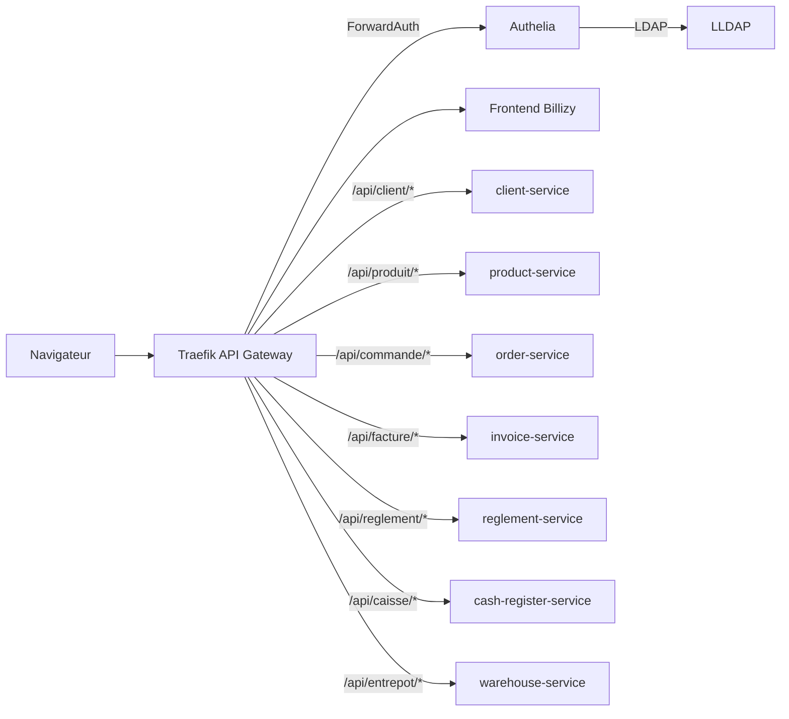

# Billizy

Billizy est une application de gestion commerciale et de facturation construite avec une architecture microservices. Elle permet de gérer les clients, les produits, les factures, les règlements, les caisses et les entrepôts depuis une interface React sobre, tout en exposant des APIs métier isolées derrière une gateway sécurisée.

Le projet sert à la fois de démonstration produit et de base technique : une interface moderne, des services Express indépendants, une persistance SQLite par domaine, et une couche d'accès sécurisée avec Traefik, Authelia et LLDAP.

## Aperçu

Billizy couvre les opérations principales d'une petite application de gestion commerciale :

- consulter et créer des enregistrements métier depuis des tableaux filtrables ;
- valider les formulaires avec Zod et React Hook Form avant l'appel API ;
- consulter les réponses complètes des microservices dans des modales ;
- protéger l'accès local avec une authentification centralisée ;
- persister les données dans des bases SQLite séparées par service.

## Fonctionnalités

| Domaine    | Fonctionnalités                                                        |
| ---------- | ---------------------------------------------------------------------- |
| Clients    | Création, consultation, modification et suppression de clients.        |
| Produits   | Gestion du catalogue, des prix, catégories et références.              |
| Factures   | Création et consultation des factures liées aux commandes.             |
| Règlements | Enregistrement des paiements, modes de règlement et caisses associées. |
| Caisses    | Suivi des caisses, devises, responsables et soldes.                    |
| Entrepôts  | Gestion des lieux de stockage, villes, adresses et capacités.          |

Le module commandes existe côté API, mais il n'est pas affiché dans la sidebar frontend pour garder l'interface de test plus claire.

## Aperçu visuel

Ces captures donnent un aperçu rapide de l'interface et de la stack sécurisée, sans avoir besoin de démarrer le projet localement.

### Interface Billizy


### Dashboard Traefik


## Stack technique

| Couche      | Technologies                                                                  |
| ----------- | ----------------------------------------------------------------------------- |
| Frontend    | React, Vite, React Router, shadcn/ui, Tailwind CSS, Hugeicons, TanStack Table |
| Formulaires | React Hook Form, Zod, `@hookform/resolvers`                                   |
| Backend     | Node.js, Express                                                              |
| Données     | SQLite par microservice                                                       |
| Sécurité    | Traefik, Authelia, LLDAP, Helmet                                              |
| Tests       | `node:test`, `npm audit`, build Vite                                          |
| Conteneurs  | Docker Compose                                                                |

## Architecture



Traefik est le seul point d'entrée public de la stack Docker. Il protège le frontend, les APIs métier, l'interface LLDAP et le dashboard Traefik avec Authelia. Les microservices restent internes aux réseaux Docker et ne sont pas exposés directement sur la machine hôte.

## Démarrage rapide

### Prérequis

- Node.js 22 ou une version compatible.
- Docker Desktop démarré.
- OpenSSL disponible pour générer les certificats locaux.
- Accès administrateur pour modifier `/etc/hosts`.

### Installation

```bash
npm install
```

### Configuration locale

Ajouter les domaines locaux dans `/etc/hosts` :

```text
127.0.0.1 app.facturation.test
127.0.0.1 admin.facturation.test
127.0.0.1 traefik.facturation.test
```

Créer le réseau Docker partagé :

```bash
docker network create proxy
```

Si Docker indique que le réseau existe déjà, l'étape peut être ignorée.

Créer le fichier d'environnement local :

```bash
cp .env.auth.example .env.auth
```

Générer le certificat TLS de développement :

```bash
npm run auth:certs
```

Lancer toute la stack :

```bash
npm run auth:up
```

## URLs locales

| URL                                      | Usage                |
| ---------------------------------------- | -------------------- |
| `https://app.facturation.test:8443`      | Application Billizy  |
| `https://app.facturation.test:8443/auth` | Portail Authelia     |
| `https://admin.facturation.test:8443`    | Administration LLDAP |
| `https://traefik.facturation.test:8443`  | Dashboard Traefik    |

Identifiants de démonstration LLDAP :

```text
username: admin
password: admin123
email: admin@facturation.test
```

Pour un usage plus sérieux, remplacer les secrets de `.env.auth` avec des valeurs générées, par exemple :

```bash
openssl rand -hex 32
```

## Scripts utiles

| Script                   | Description                                                                |
| ------------------------ | -------------------------------------------------------------------------- |
| `npm run auth:certs`     | Génère le certificat TLS local pour `*.facturation.test`.                  |
| `npm run auth:config`    | Valide la configuration Docker Compose complète.                           |
| `npm run auth:up`        | Build et lance Traefik, Authelia, LLDAP, le frontend et les microservices. |
| `npm run auth:down`      | Arrête la stack Docker.                                                    |
| `npm run auth:ps`        | Affiche l'état des conteneurs.                                             |
| `npm run dev:frontend`   | Lance le frontend Vite en développement.                                   |
| `npm run build:frontend` | Compile le frontend.                                                       |
| `npm test`               | Lance les tests automatisés.                                               |
| `npm start`              | Lance les microservices en local sans gateway ni authentification.         |

## Développement

Le frontend peut être lancé seul en mode Vite :

```bash
npm run dev:frontend
```

URL de développement :

```text
http://localhost:5173
```

Ce mode est pratique pour travailler l'interface. Pour tester l'authentification Authelia, le routage Traefik et les APIs protégées, utiliser la stack Docker complète avec `npm run auth:up`.

Les microservices peuvent aussi être lancés sans Traefik ni Authelia :

```bash
npm start
```

Lancement individuel :

```bash
npm run start:clients
npm run start:produits
npm run start:commandes
npm run start:factures
npm run start:reglements
npm run start:caisses
npm run start:entrepots
```

## Données et persistance

Chaque microservice possède sa propre base SQLite locale sous `services/<service>/data/`. Les schémas SQL sont versionnés avec le dépôt, tandis que les fichiers runtime `.sqlite`, `.sqlite-wal`, `.sqlite-shm` et `.sqlite-journal` sont ignorés par Git.

Ce choix garde une séparation claire entre les domaines métier tout en évitant les anciens fichiers JSON comme base de données.

## API

Le frontend appelle les APIs via Traefik avec le préfixe `/api/:service`. Traefik retire ce préfixe avant de transmettre la requête au microservice cible.

| URL publique          | Cible interne                            |
| --------------------- | ---------------------------------------- |
| `/api/client/list`    | `http://client-service:3002/list`        |
| `/api/produit/list`   | `http://product-service:3003/list`       |
| `/api/commande/list`  | `http://order-service:3005/list`         |
| `/api/facture/list`   | `http://invoice-service:3006/list`       |
| `/api/reglement/list` | `http://reglement-service:3007/list`     |
| `/api/caisse/list`    | `http://cash-register-service:3008/list` |
| `/api/entrepot/list`  | `http://warehouse-service:3009/list`     |

Chaque microservice suit le même contrat CRUD :

| Action    | Méthode  | Endpoint natif |
| --------- | -------- | -------------- |
| Créer     | `POST`   | `/create`      |
| Lister    | `GET`    | `/list`        |
| Voir      | `GET`    | `/view/:id`    |
| Modifier  | `PATCH`  | `/edit/:id`    |
| Supprimer | `DELETE` | `/delete/:id`  |

### Résilience des échanges

- Les appels interservices ont un délai maximal configurable avec `HTTP_TIMEOUT_MS`.
- Les lectures `GET` sont retentées sur les erreurs réseau et les réponses transitoires `5xx` ; les écritures ne sont jamais retentées automatiquement.
- Un `X-Request-Id` est propagé entre le navigateur et les services pour corréler les erreurs.
- La création d'un règlement accepte `Idempotency-Key` afin qu'une même requête rejouée ne crée pas de doublon.
- Les changements de règlement enregistrent, dans la même transaction SQLite, une synchronisation du statut de la facture. Si le service facture est indisponible, cette synchronisation reste en attente et est rejouée périodiquement.

La cohérence entre règlements et factures est donc éventuelle en cas de panne réseau : le règlement reste la source de vérité du montant payé et le statut de la facture converge lorsque le service redevient disponible.

Exemple de création client :

```http
POST /api/client/create
Content-Type: application/json
```

```json
{
  "nom": "SAGBO",
  "prenom": "Dieudonné Marie-Christ",
  "telephone": "+22901XXXXXXXX",
  "email": "mariechristsagbo@gmail.com",
  "adresse": "Cotonou, Benin"
}
```

Le frontend expose aussi `/api/me`, qui lit les headers `Remote-*` transmis par Authelia pour afficher l'utilisateur connecté.

## Sécurité et qualité

- Traefik est le seul service qui publie des ports sur l'hôte : `8080:80` et `8443:443`.
- Authelia protège l'application, les APIs, l'administration LLDAP et le dashboard Traefik.
- LLDAP centralise les utilisateurs de démonstration.
- Les services Express utilisent Helmet et une gestion d'erreurs commune.
- Les conteneurs métier exposent un healthcheck et les services dépendants attendent leur disponibilité.
- Les erreurs inattendues côté backend sont masquées pour éviter d'exposer des détails internes.
- Les validations backend sont standardisées avec des helpers partagés.
- Les formulaires frontend sont validés avec Zod et React Hook Form.
- Les bases SQLite runtime et les certificats générés localement ne sont pas suivis par Git.

Commandes de vérification :

```bash
npm run check
```

Cette commande exécute ESLint, la vérification Prettier, les tests, le build frontend et `npm audit`.

## Notes locales

- Le certificat TLS généré par `npm run auth:certs` est auto-signé. Un avertissement navigateur est normal en développement local.
- Les domaines `*.facturation.test` doivent être déclarés dans `/etc/hosts` pour que Traefik puisse router correctement les requêtes.
- Le port HTTPS local est `8443` afin d'éviter les conflits avec d'autres services utilisant déjà le port `443`.
- Les scripts `auth:*` passent par `scripts/compose-auth.sh` pour éviter de répéter la commande Docker Compose complète.
