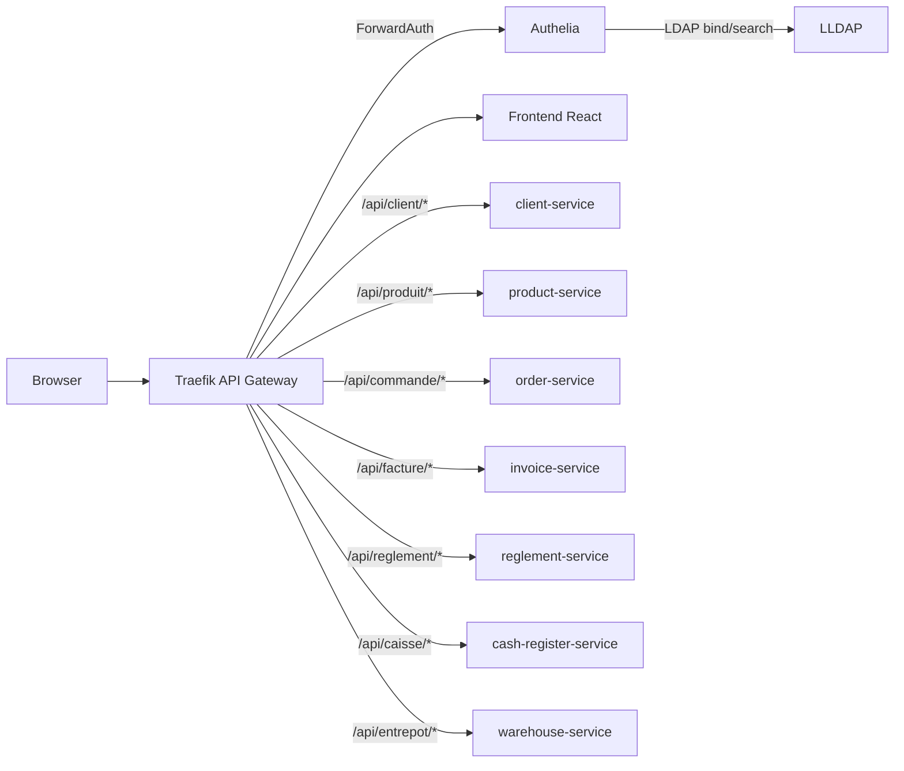

# Facturation microservices

Application de facturation construite autour de microservices Node.js/Express, d'une interface React et d'une couche d'accès sécurisée avec Traefik, Authelia et LLDAP.

Le projet sert à deux objectifs: exposer des APIs métier simples et cohérentes, puis montrer comment les placer derrière une gateway et une authentification centralisée comme dans une architecture de microservices.

## Aperçu

| Élément | Rôle |
| --- | --- |
| Frontend React/Vite | Interface métier CRUD pour clients, produits, commandes, factures, règlements, caisses et entrepôts. |
| Microservices Express | Services métier indépendants avec endpoints `/create`, `/list`, `/view/:id`, `/edit/:id`, `/delete/:id`. |
| Traefik | API Gateway et reverse proxy. C'est le seul point d'entrée public de la stack Docker. |
| Authelia | Portail d'authentification et middleware `ForwardAuth` pour protéger l'application. |
| LLDAP | Annuaire LDAP léger utilisé par Authelia pour vérifier les utilisateurs et groupes. |

## Architecture



Flux principal:

1. Le navigateur ouvre `https://app.facturation.test:8443`.
2. Traefik reçoit la requête et demande à Authelia si l'utilisateur est connecté.
3. Authelia vérifie l'identité dans LLDAP.
4. Si la session est valide, Traefik laisse passer la requête vers le frontend ou le microservice concerné.
5. Les microservices ne sont pas exposés directement sur la machine hôte.

## Captures

### Architecture microservice


### Dashboard Traefik


## Services métier

| Service | Nom Docker | Port interne | Rôle |
| --- | --- | --- | --- |
| Client | `client-service` | `3002` | Gestion des clients |
| Produit | `product-service` | `3003` | Gestion des produits |
| Commande | `order-service` | `3005` | Gestion des commandes |
| Facture | `invoice-service` | `3006` | Génération et consultation des factures |
| Règlement | `reglement-service` | `3007` | Enregistrement des paiements |
| Caisse | `cash-register-service` | `3008` | Gestion des caisses |
| Entrepôt | `warehouse-service` | `3009` | Gestion des entrepôts |

Dans la stack Docker, ces ports sont internes au réseau Docker. Le navigateur passe toujours par Traefik.

Chaque microservice persiste ses données dans sa propre base SQLite locale sous `services/<service>/data/`. Les schemas SQL sont versionnes avec le depot; les fichiers runtime `.sqlite` sont generes localement au demarrage et ignores par Git.

## Prérequis

- Node.js 22 ou une version compatible avec le projet.
- Docker Desktop démarré.
- OpenSSL disponible localement pour générer le certificat de développement.
- Accès administrateur pour modifier `/etc/hosts`.

Installer les dépendances:

```bash
npm install
```

## Configuration locale

### 1. Déclarer les domaines locaux

Ajouter ces lignes dans `/etc/hosts`:

```text
127.0.0.1 app.facturation.test
127.0.0.1 admin.facturation.test
127.0.0.1 traefik.facturation.test
```

Ces domaines pointent vers la machine locale. Traefik utilise ensuite le nom de domaine pour décider quel service doit recevoir la requête.

### 2. Créer le réseau Docker partagé

```bash
docker network create proxy
```

Si Docker indique que le réseau existe déjà, passer à l'étape suivante. Ce réseau permet à Traefik de joindre le frontend, Authelia, LLDAP et les microservices.

### 3. Créer les variables locales

```bash
cp .env.auth.example .env.auth
```

Pour une démonstration locale, le fichier fournit l'utilisateur LLDAP suivant:

```text
username: admin
password: admin123
```

Pour un usage plus sérieux, remplacer les secrets de `.env.auth` avec des valeurs générées par exemple via:

```bash
openssl rand -hex 32
```

### 4. Générer le certificat TLS local

```bash
npm run auth:certs
```

Le certificat auto-signé est généré dans `infra/traefik/certs/`. Le navigateur peut afficher un avertissement de sécurité, ce qui est normal pour un certificat local non émis par une autorité publique.

## Démarrage

Vérifier la configuration Docker Compose:

```bash
npm run auth:config
```

Lancer toute la stack:

```bash
npm run auth:up
```

Arrêter la stack:

```bash
npm run auth:down
```

Voir l'état des conteneurs:

```bash
npm run auth:ps
```

Les scripts `auth:*` utilisent `scripts/compose-auth.sh`, ce qui évite de répéter la commande Docker Compose complète.

## URLs locales

| URL | Usage |
| --- | --- |
| `https://app.facturation.test:8443` | Application React |
| `https://app.facturation.test:8443/auth` | Portail Authelia |
| `https://admin.facturation.test:8443` | Interface d'administration LLDAP |
| `https://traefik.facturation.test:8443` | Dashboard Traefik |

Le port `8443` côté machine correspond au port `443` du conteneur Traefik. Cette configuration évite les conflits avec d'autres projets qui utilisent déjà le port `443`.

## Routage API

Le frontend appelle les APIs via Traefik, avec le préfixe `/api/:service`.

Le seul endpoint applicatif servi par le frontend est `/api/me`. Il lit les headers `Remote-*` ajoutés après authentification Authelia pour afficher l'utilisateur connecté.

| URL publique | Middleware Traefik | Cible interne |
| --- | --- | --- |
| `/api/client/list` | `StripPrefix(/api/client)` | `http://client-service:3002/list` |
| `/api/produit/list` | `StripPrefix(/api/produit)` | `http://product-service:3003/list` |
| `/api/commande/list` | `StripPrefix(/api/commande)` | `http://order-service:3005/list` |
| `/api/facture/list` | `StripPrefix(/api/facture)` | `http://invoice-service:3006/list` |
| `/api/reglement/list` | `StripPrefix(/api/reglement)` | `http://reglement-service:3007/list` |
| `/api/caisse/list` | `StripPrefix(/api/caisse)` | `http://cash-register-service:3008/list` |
| `/api/entrepot/list` | `StripPrefix(/api/entrepot)` | `http://warehouse-service:3009/list` |

Exemple: le navigateur appelle `/api/client/list`. Traefik retire `/api/client`, puis transmet `/list` au service `client-service`.

Chaque service suit le même contrat:

| Action | Méthode | Endpoint natif |
| --- | --- | --- |
| Créer | `POST` | `/create` |
| Lister | `GET` | `/list` |
| Voir | `GET` | `/view/:id` |
| Modifier | `PATCH` | `/edit/:id` |
| Supprimer | `DELETE` | `/delete/:id` |

## Sécurité et exposition réseau

Dans le mode Docker sécurisé:

- Traefik est le seul service qui publie des ports sur l'hôte: `8080:80` et `8443:443`.
- Le frontend, Authelia, LLDAP et les microservices restent accessibles uniquement dans les réseaux Docker.
- Les APIs métier sont protégées par Authelia avant d'être transmises aux microservices.
- L'interface LLDAP et le dashboard Traefik sont également protégés par Authelia.

Le projet utilise le provider fichier de Traefik dans `infra/traefik/dynamic.yml`. Les routes ne sont donc pas déclarées avec des labels Docker.

## Fichiers de configuration

| Fichier | Rôle |
| --- | --- |
| `docker-compose.yml` | Traefik, ports publics et provider fichier |
| `docker-compose.auth.yml` | Authelia et LLDAP |
| `docker-compose.frontend.yml` | Frontend React servi en production par Node |
| `docker-compose.microservices.yml` | Microservices métier |
| `infra/traefik/dynamic.yml` | Routers, middlewares, services et certificat TLS Traefik |
| `infra/authelia/configuration.yml` | Politique d'accès Authelia et connexion LDAP vers LLDAP |
| `scripts/compose-auth.sh` | Wrapper de commande Docker Compose |

## Développement frontend

Le frontend peut aussi être lancé seul en mode développement Vite:

```bash
npm run dev:frontend
```

URL de développement:

```text
http://localhost:5173
```

Ce mode sert au développement de l'interface. Pour tester l'authentification Authelia, le routage Traefik et les APIs protégées, utiliser `https://app.facturation.test:8443` avec `npm run auth:up`.

Build du frontend:

```bash
npm run build:frontend
```

## Mode backend simple

Pour travailler uniquement sur les microservices sans Traefik ni Authelia:

```bash
npm start
```

Lancement individuel:

```bash
npm run start:clients
npm run start:produits
npm run start:commandes
npm run start:factures
npm run start:reglements
npm run start:caisses
npm run start:entrepots
```

Ce mode est utile pour développer rapidement un service, mais il ne représente pas l'architecture sécurisée de démonstration.

## Scripts utiles

| Script | Description |
| --- | --- |
| `npm run auth:certs` | Génère le certificat TLS local pour `*.facturation.test`. |
| `npm run auth:config` | Valide la configuration Docker Compose complète. |
| `npm run auth:up` | Build et lance Traefik, Authelia, LLDAP, frontend et microservices. |
| `npm run auth:down` | Arrête la stack Docker. |
| `npm run auth:ps` | Affiche les conteneurs de la stack. |
| `npm run dev:frontend` | Lance le frontend Vite en développement. |
| `npm run build:frontend` | Compile le frontend. |
| `npm start` | Lance les microservices en local sans gateway. |

## Documentation officielle

- [Traefik - Routing overview](https://doc.traefik.io/traefik/routing/overview/)
- [Traefik - File provider](https://doc.traefik.io/traefik/reference/install-configuration/providers/others/file/)
- [Traefik - ForwardAuth middleware](https://doc.traefik.io/traefik/reference/routing-configuration/http/middlewares/forwardauth/)
- [Traefik - StripPrefix middleware](https://doc.traefik.io/traefik/reference/routing-configuration/http/middlewares/stripprefix/)
- [Authelia - Intégration Traefik](https://www.authelia.com/integration/proxies/traefik/)
- [Authelia - LDAP authentication backend](https://www.authelia.com/configuration/first-factor/ldap/)
- [Authelia - Access control](https://www.authelia.com/configuration/security/access-control/)
- [LLDAP - Projet GitHub](https://github.com/lldap/lldap)

## Dépannage

### Le domaine ne répond pas

Vérifier que `/etc/hosts` contient bien:

```text
127.0.0.1 app.facturation.test
127.0.0.1 admin.facturation.test
127.0.0.1 traefik.facturation.test
```

### Le navigateur affiche une alerte TLS

C'est attendu avec un certificat auto-signé local. Pour une démonstration locale, continuer vers le site après avoir vérifié que l'URL est bien `*.facturation.test:8443`.

### Le port 443 est déjà utilisé

La stack publie Traefik sur `8443` côté machine pour éviter ce conflit. Utiliser donc `https://app.facturation.test:8443` et non `https://app.facturation.test`.

### Authelia ne se connecte pas à LLDAP au premier démarrage

LLDAP peut prendre quelques secondes à initialiser sa base et son utilisateur admin. Relancer la stack règle généralement ce cas:

```bash
npm run auth:down
npm run auth:up
```

### Le dashboard Traefik ne s'affiche pas

Vérifier que la stack est lancée et que l'utilisateur connecté appartient au groupe autorisé dans LLDAP. En local, l'utilisateur `admin` créé par LLDAP est prévu pour administrer la démonstration.

## Notes de projet

- Les schemas SQL des services sont versionnes; les bases SQLite runtime sous `services/*/data/` restent locales et ignorees par Git.
- Les certificats générés localement dans `infra/traefik/certs/` ne doivent pas être utilisés en production.
